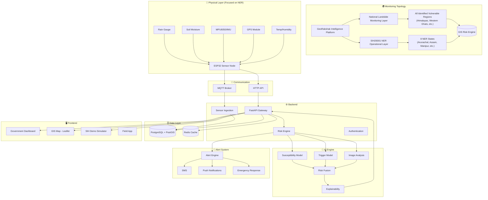
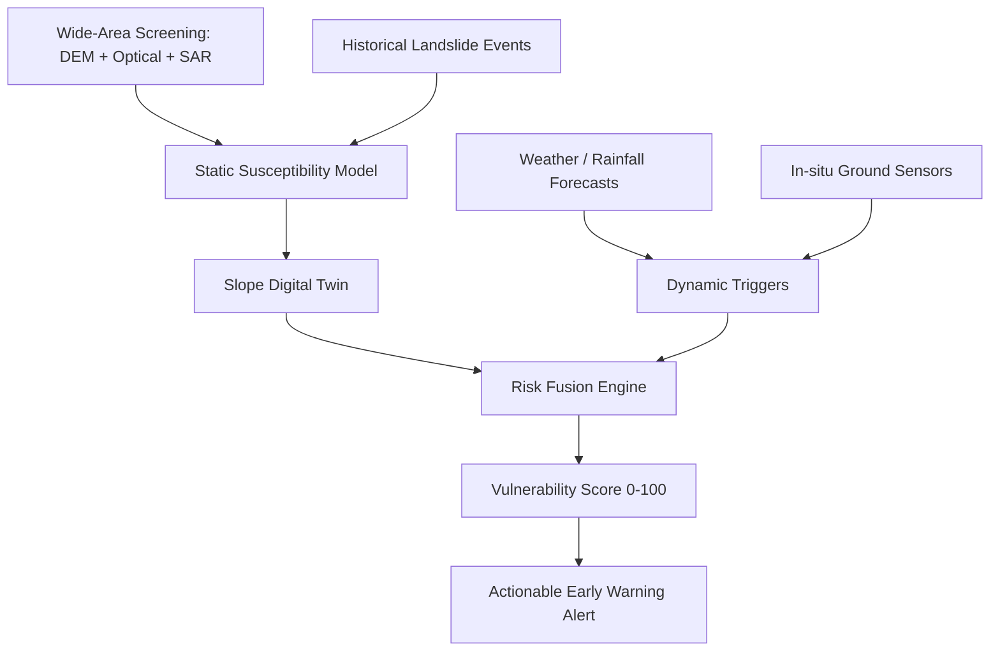
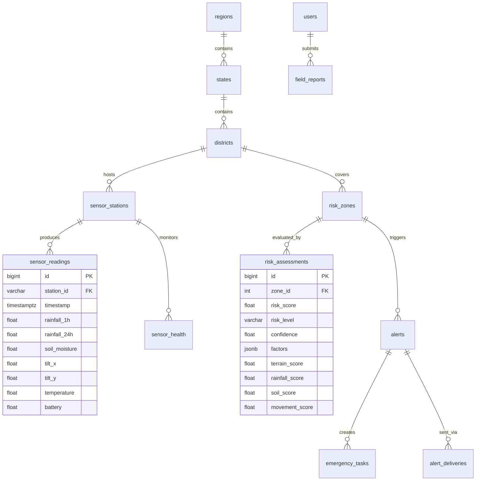

# GeoRakshak — System Architecture

## System Overview



## Data Flow

```
Sensor / Simulator → MQTT/HTTP → Ingestion → PostgreSQL
                                                  ↓
Weather API → Adapter ──────────────→ Feature Engineering
Satellite API → Adapter ─────────────→       ↓
Terrain Data → Adapter ──────────────→ AI Risk Engine
Historical Events → DB ──────────────→       ↓
                                        Risk Fusion
                                             ↓
                                   Score + Confidence + Reasons
                                             ↓
                              ┌──────────────┼──────────────┐
                              ↓              ↓              ↓
                          GIS Map        Alert Engine    Emergency
                              ↓              ↓           Response
                         Dashboard       SMS/Push/App      Queue
```

## Technology Stack

| Layer | Technology | Purpose |
|-------|-----------|---------|
| Frontend | Next.js 16 + React 19 + TypeScript | Government dashboard |
| Styling | Tailwind CSS v4 | Design system |
| GIS | Leaflet + CartoDB dark tiles | Risk zone map |
| Charts | Recharts | Data visualization |
| Backend | FastAPI + Python 3.11 | API gateway |
| ORM | SQLAlchemy + GeoAlchemy2 | Database access |
| Database | PostgreSQL 16 + PostGIS 3.4 | Spatial data |
| Cache | Redis 7 | Session/real-time cache |
| Messaging | MQTT (Mosquitto) | IoT data transport |
| IoT | ESP32 + PlatformIO | Sensor firmware |
| AI/ML | scikit-learn, XGBoost | Risk models |
| Mobile | React Native + Expo | Field app |
| DevOps | Docker Compose | Orchestration |

## Core Multi-Layer Geospatial Architecture

GeoRakshak is designed to scale dynamically from a **National / State layer** down to a **monitored slope cell**. Following ISRO/NRSC standards, our data architecture fuses static spatial maps with dynamic telemetry to compute risk.

### Geospatial Intelligence Data Layers

| Layer | Data Source | Purpose |
|-------|------------|---------|
| DEM / Topography | SRTM / CartoDEM | Elevation, Slope, Aspect, Curvature |
| Optical Satellite | Sentinel-2 / Resourcesat | Surface change, vegetation, fresh scarps |
| SAR / InSAR | Sentinel-1 Radar | Ground deformation (mm/cm changes) |
| Geology / Soil | GSI | Lithology, material stability |
| Historical Inventory | NRSC Landslide Atlas | Susceptibility training & calibration |
| Real-time Triggers | IMD / OpenWeather | Precipitation, 7-day antecedent rainfall |
| Ground Sensors | ESP32 Hardware | Soil moisture, tilt, local precipitation |

### Risk Fusion Pipeline



## API Endpoints (Phase 1)

| Method | Endpoint | Description |
|--------|----------|-------------|
| GET | `/api/health` | Health check |
| GET | `/api/dashboard/stats` | Aggregate zone/sensor/alert counts |
| GET | `/api/dashboard/priorities` | Top emergency priorities |
| GET | `/api/sensors` | All stations + latest readings |
| GET | `/api/sensors/{id}/readings` | Time-series readings |
| POST | `/api/sensors/readings` | Ingest reading (ESP32/simulator) |
| GET | `/api/risk-zones` | GeoJSON risk zone polygons |
| GET | `/api/risk-zones/{id}/assessment` | Risk assessment with explainability |
| GET | `/api/alerts` | Active alerts |
| GET | `/api/landslides` | Historical events GeoJSON |
| POST | `/api/simulator/event` | Trigger simulation scenario |
| GET | `/api/states` | NER states |
| GET | `/api/districts` | Districts by state |

## Database Schema (Key Tables & Hierarchy)


```
Hierarchy:
country → region → state → district → sub_district → village/location → risk_zone → sensor_station → sensor_readings
```



## Risk Engine (Phase 1 — Rule-Based)

```
Weighted Fusion:
  Terrain Susceptibility  × 0.25
  Rainfall Trigger        × 0.30
  Soil Moisture           × 0.20
  Ground Movement         × 0.15
  Historical Density      × 0.10
  ──────────────────────────────
  = Composite Risk Score (0-100)

Risk Levels:
  0-39   → LOW
  40-59  → MODERATE
  60-79  → HIGH
  80-100 → CRITICAL

Note: Thresholds are configurable placeholders,
not universally validated scientific cutoffs.
```

## Security Architecture

| Feature | Implementation |
|---------|---------------|
| Authentication | JWT tokens |
| Authorization | Role-Based Access Control (RBAC) |
| Roles | SUPER_ADMIN, STATE_ADMIN, DISTRICT_ADMIN, DISASTER_OFFICER, FIELD_OFFICER, CITIZEN |
| Transport | HTTPS-ready |
| Input | Pydantic validation |
| Audit | audit_logs table |
